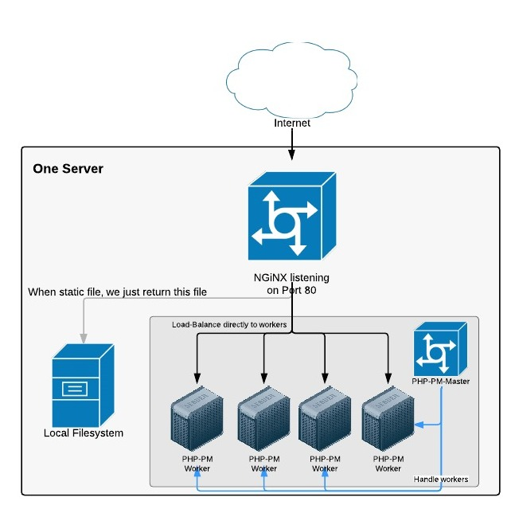
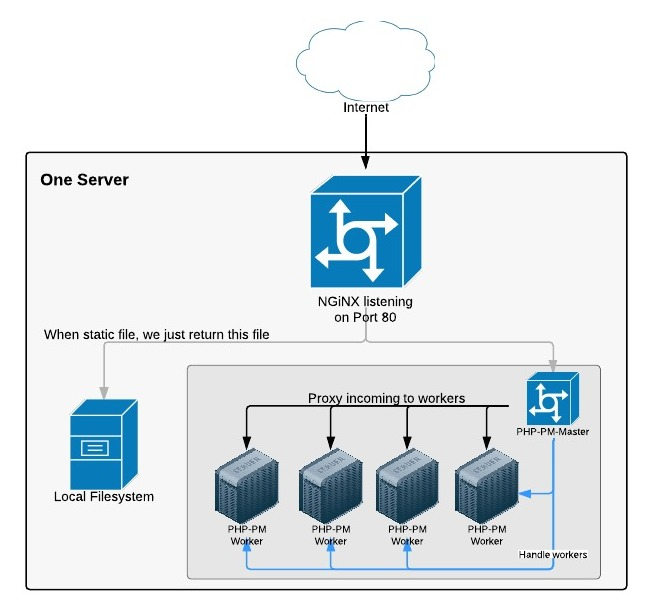

PHP Process Manager
====================================================

<p align="center">

</p>

PHP-PM is a process manager for Request-Response Frameworks running in a ReactPHP environment.
The approach of this is to kill the expensive bootstrap of PHP (declaring symbols) and bootstrap of feature-rich frameworks.

More information can be found in the article: [Bring High Performance Into Your PHP App (with ReactPHP)](http://marcjschmidt.de/blog/2014/02/08/php-high-performance.html)

### Installation

```bash
$ git clone git@github.com:php-pm/php-pm.git
$ cd php-pm
$ composer install
$ ./bin/ppm
```

### Command


### Example

```bash
$ ./bin/ppm start ~/my/path/to/symfony/ --bridge=httpKernel
```

Each worker starts its own HTTP Server which listens on port 5501, 5502, 5503 etc. Range is `5501 -> 5500+<workersCount>`.

### Setup 1. Use external Load-Balancer



Example config for NGiNX:

```nginx
upstream backend  {
    server 127.0.0.1:5501;
    server 127.0.0.1:5502;
    server 127.0.0.1:5503;
    server 127.0.0.1:5504;
    server 127.0.0.1:5505;
    server 127.0.0.1:5506;
}

server {
    root /path/to/symfony/web/;
    server_name servername.com;
    location / {
        try_files $uri @backend;
    }
    location @backend {
        proxy_pass http://backend;
    }
}
```

### Setup 2. Use internal Load-Balancer

This setup is slower as we can't load balance incoming connections as fast as NGiNX it does,
but it's perfect for testing purposes.


